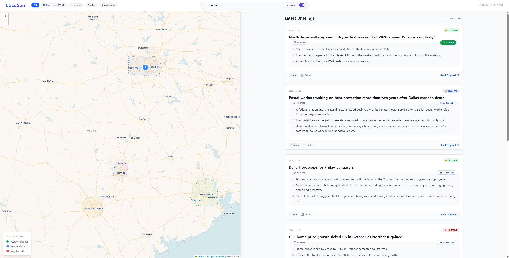
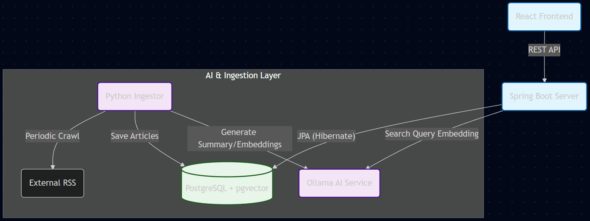
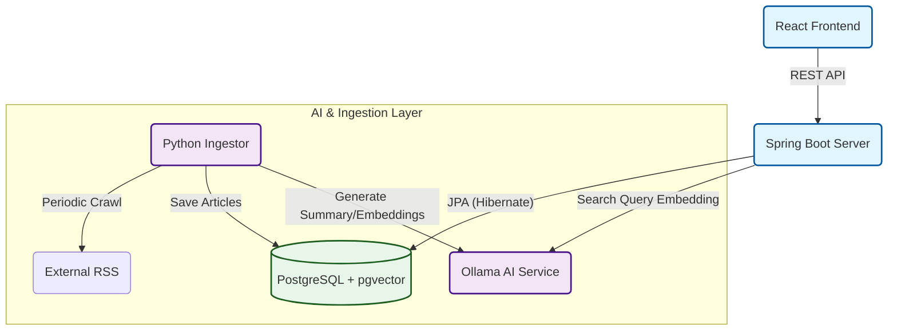

# LocuSum 🌍
> **Local + Summary**: 위치 기반 AI 뉴스 요약 및 시각화 플랫폼

LocuSum은 텍사스 주요 도시(Dallas, Houston, Austin, San Antonio)의 뉴스를 수집하여 **AI로 요약**하고, **감성 분석(Sentiment Analysis)** 결과를 지도 위에 시각화하여 보여주는 프로젝트입니다.

지역별 이슈를 빠르게 파악하고, 단순 키워드 매칭을 넘어선 **의미 기반(Semantic) 검색**을 통해 원하는 정보를 정확하게 찾을 수 있습니다.


## ✨ 주요 기능

*   **📰 AI 기반 뉴스 요약**: 긴 기사를 로컬 LLM(Ollama)을 사용하여 3줄 요약 제공
*   **☺️ 감성 분석 지도**: 기사의 논조(긍정/중립/부정)를 분석하여 지도 마커 색상으로 시각화
    *   초록색: 긍정 (Positive)
    *   파란색: 중립 (Neutral)
    *   빨간색: 부정 (Negative)
*   **🔍 스마트 검색 (Smart Search)**: 
    *   단순 단어 검색뿐만 아니라 문맥을 이해하는 **Vector Similarity Search** 지원
    *   "범죄 증가에 대한 우려"라고 검색하면 정확한 단어가 없어도 관련 기사 노출
*   **🗺️ 인터랙티브 맵**:
    *   자유로운 지도 영역 크기 조절 (Resizable Split View)
    *   지역별 기사 필터링 및 통계 제공

## 🛠️ 기술 스택

### Frontend
*   **Framework**: React, TypeScript, Vite
*   **Styling**: Tailwind CSS
*   **Map**: React Leaflet

### Backend
*   **Framework**: Spring Boot 3 (Kotlin)
*   **Database**: PostgreSQL + **pgvector** (벡터 DB 익스텐션)
*   **Build Tool**: Gradle

### Ingestor & AI
*   **Language**: Python
*   **Framework**: SQLModel
*   **AI Engine**: Ollama (Llama 3, Nomic Embed Text 등 로컬 모델 구동)
*   **Library**: Feedparser (RSS 수집), LangChain (선택적)

### Infra
*   **Docker Compose**: 전체 서비스(Front, Back, DB, AI, Ingestor) 오케스트레이션

## 🏗️ System Architecture

LocuSum은 **Docker Compose**를 기반으로 5개의 주요 서비스가 유기적으로 연결되어 동작합니다.


---

## 🧠 AI Processing Pipeline

새로운 뉴스가 수집되어 검색 가능한 상태가 되기까지 **5단계 파이프라인**을 거칩니다.

1.  **Crawl**: Python Ingestor가 10분 주기로 주요 지역 언론사(RSS)를 스캔합니다.
2.  **Summary**: 본문 내용을 Ollama(`llama3`)에게 전달하여 **3줄 요약**을 생성합니다.
3.  **Sentiment**: 요약된 텍스트의 뉘앙스를 분석하여 **감성 점수**(-1.0 ~ 1.0)를 산출합니다.
4.  **Embedding**: **요약본**을 기반으로 `nomic-embed-text` 모델을 통해 768차원 벡터를 생성합니다.
5.  **Vector Store**: 생성된 벡터와 메타데이터를 PostgreSQL의 `vector` 컬럼에 저장합니다.

---

## ⚡ Engineering & Hardware Optimization

### 1. GPU Acceleration
Docker 컨테이너 내부의 Ollama가 호스트 머신의 **GPU**에 직접 접근할 수 있도록 설정했습니다.
*   **설정**: Docker Compose의 `deploy.resources.reservations.devices` 옵션을 사용하여 GPU Passthrough 구현
*   **성과**: CPU 대비 **약 20배 빠른 연산 속도**로 실시간 요약 및 임베딩 처리 가능

### 2. Summary-based Embedding Strategy
기사 원문(Full Text)을 그대로 벡터화하지 않고, **요약문(Summary)을 벡터화**하는 전략을 채택했습니다.
*   **이유**: 뉴스 기사 원문에는 광고, 인사말, 불필요한 서술 등 "노이즈"가 많아 벡터의 의미가 희석될 수 있습니다.
*   **효과**: AI가 핵심만 추려낸 요약본을 임베딩함으로써, 사용자가 검색했을 때 **의도한 주제와 훨씬 더 정확하게 매칭(Sementic Score 향상)**되는 결과를 얻었습니다.


---

## 🚀 설치 및 실행 방법

이 프로젝트는 Docker Compose를 통해 한 번에 실행할 수 있습니다.

### 필수 요건
*   Docker & Docker Compose
*   Ollama (로컬 실행 시 필요할 수 있음, 또는 도커 내부 Ollama 서비스 사용)

### 실행 순서

1.  **레포지토리 클론**
    ```bash
    git clone https://github.com/Callein/locusum.git
    cd locusum
    ```

2.  **환경 변수 설정 (Optional)**
    *   기본적으로 `docker-compose.yml`에 설정되어 있습니다.

3.  **서비스 실행**
    ```bash
    docker compose up -d --build
    ```
    *   초기 실행 시 Ollama 모델(`nomic-embed-text`, 요약용 LLM)을 pull 받아야 하므로 시간이 소요될 수 있습니다.


## 📂 프로젝트 구조

```
locusum/
├── client/          # React Frontend 소스
├── server/          # Spring Boot Backend 소스 (Kotlin)
├── ingestor/        # Python 뉴스 수집기 및 AI 처리 워커
├── docker-compose.yml
└── README.md
```

## 📝 라이선스

This project is licensed under the MIT License.
