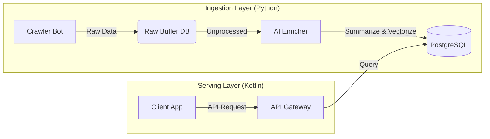

# 기획 V2

생성일: 2025년 12월 5일 오후 2:09

# 🚀 프로젝트 계획서: LocuSum (Local + Summary)

## 1. 프로젝트 개요 (Project Overview)

### 1.1 기본 정보

- **프로젝트명:** LocuSum
- **슬로건:** "Less Noise, More Insight. Your Community, Condensed."
- **주제:** 인공지능(LLM) 기반 로컬 뉴스 자동 수집, 분류 및 요약 시스템
- **목표:** 정보의 홍수 속에서 지역(Local)에 특화된 정보를 선별하고, 생성형 AI를 통해 사용자 맞춤형으로 요약하여 제공함으로써 정보 접근성을 혁신함.

### 1.2 개발 배경 및 필요성

1. **정보 파편화:** 지역 뉴스와 커뮤니티 정보가 여러 플랫폼에 산재되어 있어 사용자가 일일이 찾아보기 어려움.
2. **정보 피로도:** 단순 사실 나열이나 중복된 기사(Copy-paste journalism)로 인해 피로감 증대.
3. **해결책:** AI 에이전트를 통한 자동 수집 및 **Semantic Summarization(의미 기반 요약)** 기술 적용.

---

## 2. 핵심 기술 스택 (Tech Stack Strategy)

| 구분 | 기술 스택 | 선정 이유 (Rationale) |
| --- | --- | --- |
| **Data & AI** | **Python 3.12+** | LangChain, Pandas 등 풍부한 AI 생태계 및 강력한 크롤링 라이브러리(Scrapy/Playwright) 보유. |
| **Backend** | **Kotlin (Spring Boot)** | 정적 타입 언어의 안정성, Coroutines를 활용한 고성능 비동기 API 서버 구축 용이. |
| **Database** | **PostgreSQL (+pgvector)** | 관계형 데이터와 임베딩 벡터(Vector) 데이터를 단일 DB에서 관리하여 시스템 복잡도 감소. |
| **Buffer Store** | **Redis / SQLite** | 수집 단계에서의 중복 URL 방지(Redis) 및 Raw Data 임시 저장(SQLite). |
| **Infra & DevOps** | **Docker / K3s** | 경량화된 쿠버네티스(K3s)를 통해 오토스케일링 및 자가 치유(Self-healing) 환경 구축. |
| **Dev Tool** | **Google Antigravity** | 클라우드 기반 AI IDE를 활용하여 인프라 설정 및 보일러플레이트 코드 생성 가속화. |

---

## 3. 시스템 아키텍처 (System Architecture)

전체 시스템은 **데이터 수집/가공 파이프라인(Python)**과 **서비스 서빙 레이어(Kotlin)**로 명확히 분리된 MSA(Microservices Architecture) 지향 구조입니다.

### 3.1 전체 구조도 (High-Level Design)



### 3.2 상세 모듈 구성

시스템은 역할에 따라 **수집(Ingestion)**, **가공(Enrichment)**, **서빙(Serving)**의 3단계 파이프라인으로 구성됩니다.

### A. 수집 모듈 (Ingestion Layer) - Python

- **역할:** 외부 데이터 소스(RSS, Web, API)로부터 원시 데이터를 빠르고 안정적으로 가져옵니다.
- **핵심 컴포넌트:**
    - **Smart Crawler:** `Scrapy` 프레임워크 기반. 사이트별 DOM 구조 변화에 대응하기 위해 `Playwright`(Headless Browser)를 플러그인으로 연동.
    - **Deduplication Filter:** URL의 SHA-256 해시값을 Redis Set에 저장/조회하여 중복 수집을 원천 차단 ($O(1)$ 속도).
    - **Raw Data Buffer:** 수집된 비정형 데이터(HTML, JSON)를 즉시 가공하지 않고 임시 저장소(SQLite/Mongo)에 적재하여 수집 속도 저하 방지.

### B. 가공 모듈 (Enrichment Layer) - Python (Worker)

- **역할:** 원시 데이터를 정제하고 AI를 통해 가치를 더합니다(Enrichment).
- **핵심 컴포넌트:**
    - **Content Cleaner:** 불필요한 HTML 태그, 광고 스크립트, 네비게이션 바 텍스트 제거.
    - **LLM Processor:** 정제된 텍스트를 LLM(GPT-4o, Llama 3 등)에 입력하여 **3줄 요약**, **카테고리 분류**, **감정 분석(Sentiment Analysis)** 수행.
    - **Vector Embedder:** `Sentence-Transformers` 모델을 사용하여 본문 내용을 고차원 벡터로 변환, 시맨틱 검색(의미 기반 검색) 준비.

### C. 서비스 모듈 (Serving Layer) - Kotlin (Spring Boot)

- **역할:** 최종 사용자에게 API를 제공하고 복잡한 검색 로직을 처리합니다.
- **핵심 컴포넌트:**
    - **API Gateway:** JWT 인증, Rate Limiting(요청 제한), 로깅 처리.
    - **Hybrid Search Engine:**
        - **Lexical Search:** PostgreSQL의 Full-Text Search(FTS)를 이용한 키워드 매칭.
        - **Semantic Search:** `pgvector`의 코사인 유사도(Cosine Similarity)를 이용한 문맥 매칭.
        - *최종 결과 = 키워드 점수 × 0.3 + 벡터 점수 × 0.7 (가중치 조정 가능)*
    - **Feed Coordinator:** 사용자 위치 기반으로 뉴스를 필터링하고 개인화 점수에 따라 정렬(Ranking).

---

## 4. 데이터베이스 설계 (Database Schema)

### 4.1 Raw Data Store (Crawler DB - SQLite)

*목적: 수집 속도 최적화 및 원본 데이터 보존 (디버깅용)*

```sql
-- crawler.db (SQLite)
CREATE TABLE raw_articles (
    id TEXT PRIMARY KEY,              -- URL의 SHA-256 해시
    url TEXT UNIQUE NOT NULL,
    source_type TEXT,                 -- RSS, WEB, API
    html_content BLOB,                -- 압축된 원본 HTML
    fetched_at DATETIME DEFAULT CURRENT_TIMESTAMP,
    process_status TEXT DEFAULT 'PENDING' -- PENDING, PROCESSING, DONE, ERROR
);
CREATE INDEX idx_status ON raw_articles(process_status);
```

### 4.2 Main Store (Service DB - PostgreSQL)

*목적: 서비스 서빙 및 벡터 검색 최적화*

```sql
-- PostgreSQL (pgvector 확장 필요)
CREATE EXTENSION IF NOT EXISTS vector;

CREATE TABLE articles (
    article_id BIGSERIAL PRIMARY KEY,
    title VARCHAR(255) NOT NULL,
    summary TEXT,                     -- AI 요약본
    content_text TEXT,                -- 정제된 본문
    original_url TEXT NOT NULL,
    region_code VARCHAR(50),          -- 지역 코드 (예: US-TX-LONGVIEW)
    published_at TIMESTAMP,
    
    -- AI 데이터
    category VARCHAR(50),
    sentiment_score FLOAT,            -- -1.0(부정) ~ 1.0(긍정)
    embedding vector(1536),           -- OpenAI 기준 1536차원
    
    created_at TIMESTAMP DEFAULT NOW()
);

-- 벡터 검색 성능 향상을 위한 HNSW 인덱스 (대량 데이터용)
CREATE INDEX ON articles USING hnsw (embedding vector_cosine_ops);
```

---

## 5. 인프라 및 운영 전략 (Infra & Ops)

### 5.1 컨테이너 오케스트레이션 (K3s 도입)

- **Infrastructure:** AWS t3.medium 또는 유사 사양의 저비용 인스턴스 1대.
- **Orchestrator:** **K3s (Lightweight Kubernetes)**
    - 도커 컴포즈보다 관리 기능이 강력하며, 추후 확장 시 표준 K8s로 이전 용이.
    - **Self-healing:** 크롤러 파드(Pod)가 메모리 누수로 죽을 경우 K3s가 자동으로 감지하고 재시작.
    - **CronJob:** 정해진 시간(예: 매시간 정각)에 크롤링 작업 자동 트리거.

### 5.2 CI/CD 파이프라인 (GitHub Actions)

1. **Code Push:** `main` 브랜치에 코드 커밋.
2. **Build & Test:** GitHub Actions 러너가 Python/Kotlin 유닛 테스트 수행 및 Docker 이미지 빌드.
3. **Deploy:**
    - 빌드된 이미지를 Container Registry(GHCR)에 업로드.
    - 운영 서버에 SSH 접속하여 `kubectl rollout restart deployment/locusum-backend` 명령 실행 (Zero-downtime 배포).

---

## 6. 기대 효과 (Expected Outcomes)

1. **기술적 성취:**
    - Python(Data)과 Kotlin(Backend)을 아우르는 **Polyglot 아키텍처** 설계 및 구현 능력 증명.
    - RDB와 Vector DB를 결합한 **Hybrid Search** 및 **RAG(Retrieval-Augmented Generation)** 패턴 실무 적용.
2. **운영 노하우 습득:**
    - 실제 서비스 운영 중 발생하는 문제(중복 수집, 사이트 차단, 데이터 파이프라인 지연)를 해결하며 **DevOps 역량** 강화.
3. **사회적 가치:**
    - 사용자가 지역 사회 이슈에 더 쉽고 빠르게 접근하게 함으로써 로컬 저널리즘 생태계 활성화 기여.