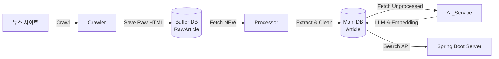

# LocuSum 인제스터 (Ingestor) 아키텍처

## 1. 개요 (Overview)
**LocuSum Ingestor**는 로컬 뉴스 데이터를 수집, 정제, 분석하여 서비스 가능한 형태로 가공하는 파이프라인 시스템입니다.
안정성과 확장성을 위해 **마이크로서비스 아키텍처**를 채택하여 수집(Crawler), 처리(Processor), 분석(AI)의 역할이 분리되어 있습니다.

## 2. 시스템 구조 (System Architecture)

### 2.1 서비스 구성 (Services)
Docker Compose를 통해 다음 3개의 독립적인 컨테이너로 실행됩니다.

1.  **Crawler Service (`locusum-crawler`)**
    -   **역할**: 뉴스 사이트(RSS, 웹페이지)를 방문하여 원본 HTML을 수집합니다.
    -   **명령어**: `python -m locusum_ingestor.runner --mode crawler`
    -   **특징**: Scrapy + Playwright를 사용하여 동적 페이지 렌더링을 지원합니다.
    -   **출력**: 원본 데이터를 Buffer DB(`raw_articles`)에 저장합니다.

2.  **Processor Service (`locusum-processor`)**
    -   **역할**: 수집된 원본 데이터에서 본문 텍스트, 기자명, 이미지 등을 추출(ETL)합니다.
    -   **명령어**: `python -m locusum_ingestor.runner --mode processor`
    -   **특징**: 불필요한 HTML 태그를 제거하고 정형화된 데이터로 변환합니다.
    -   **출력**: 정제된 데이터를 Main DB(`articles`)에 저장합니다.

3.  **AI Service (`locusum-ai`)**
    -   **역할**: 기사 내용을 분석하여 부가가치를 창출합니다.
    -   **명령어**: `python -m locusum_ingestor.runner --mode ai`
    -   **기능**:
        -   **3줄 요약**: LLM(Ollama/Llama3)을 사용하여 핵심 내용을 요약합니다.
        -   **임베딩 생성**: 텍스트를 벡터(Vector, 768차원)로 변환하여 하이브리드 검색을 지원합니다.
    -   **출력**: Main DB(`articles`)의 `summary`, `embedding` 필드를 업데이트합니다.

## 3. 데이터 흐름 (Data Flow)

## 4. 데이터베이스 스키마 (Database Schema)

### 4.1 Main DB: `articles` (PostgreSQL)
서비스에서 실제로 사용하는 핵심 데이터 테이블입니다.

| 컬럼명 (Column) | 타입 (Type) | 필수 여부 | 설명 (Description) |
| :--- | :--- | :--- | :--- |
| **`article_id`** | `BIGINT` | **PK** | 기사 고유 ID (Auto Increment) |
| `original_url` | `VARCHAR` | Unique | 원본 기사 URL (중복 방지용) |
| `title` | `VARCHAR` | Not Null | 기사 제목 |
| `content_text` | `TEXT` | Not Null | HTML 태그가 제거된 순수 본문 텍스트 |
| `summary` | `TEXT` | Nullable | **AI가 생성한 3줄 요약** |
| `region_code` | `VARCHAR` | Nullable | 지역 코드 (예: TX, KR-11 등) |
| `published_at` | `TIMESTAMP` | Nullable | 기사 발행 일시 |
| `author` | `VARCHAR` | Nullable | 기자 또는 작성자 이름 |
| `image_url` | `VARCHAR` | Nullable | 썸네일 또는 대표 이미지 URL |
| `category` | `VARCHAR` | Nullable | 뉴스 카테고리 |
| `sentiment_score`| `DOUBLE` | Nullable | 감성 분석 점수 (-1.0 ~ 1.0) |
| `embedding` | `VECTOR(768)`| Nullable | **벡터 검색용 임베딩 데이터** (pgvector) |
| `created_at` | `TIMESTAMP` | Default Now | 데이터 생성(수집) 일시 |

### 4.2 Buffer DB: `raw_articles`
크롤링 속도 보장을 위해 원본 데이터를 임시 저장하는 테이블입니다.

| 컬럼명 (Column) | 타입 (Type) | 필수 여부 | 설명 (Description) |
| :--- | :--- | :--- | :--- |
| **`id`** | `VARCHAR` | **PK** | URL의 SHA-256 해시값 |
| `url` | `VARCHAR` | Unique | 원본 URL |
| `html_content` | `TEXT` | Not Null | 수집된 원본 HTML 전체 |
| `status` | `VARCHAR` | Default 'NEW'| 처리 상태 (`NEW`, `PROCESSED`, `ERROR`, `FAILED_EMPTY`) |
| `source` | `VARCHAR` | Not Null | 출처 소스명 (예: dallas_news) |
| `fetched_at` | `TIMESTAMP` | Default Now | 수집 시각 |

## 5. 주요 기술 스택 (Tech Stack)
- **Framework**: Python 3.12, Scrapy, SQLModel (SQLAlchemy)
- **Browser Automation**: Playwright (Headless Chrome)
- **Database**: PostgreSQL 16 (+pgvector Extension)
- **AI/LLM**: Ollama (Llama 3), Nomic Embed Text
- **Resilience**: Tenacity (Retry Logic)
